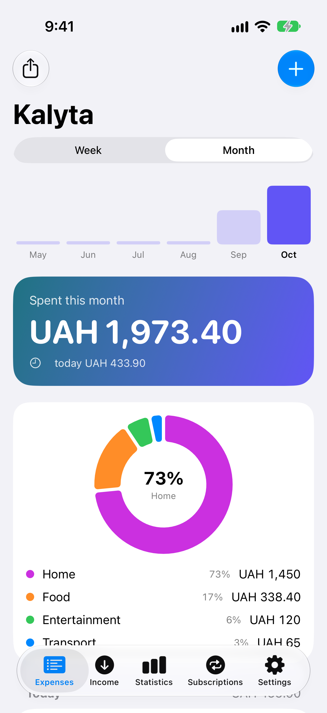
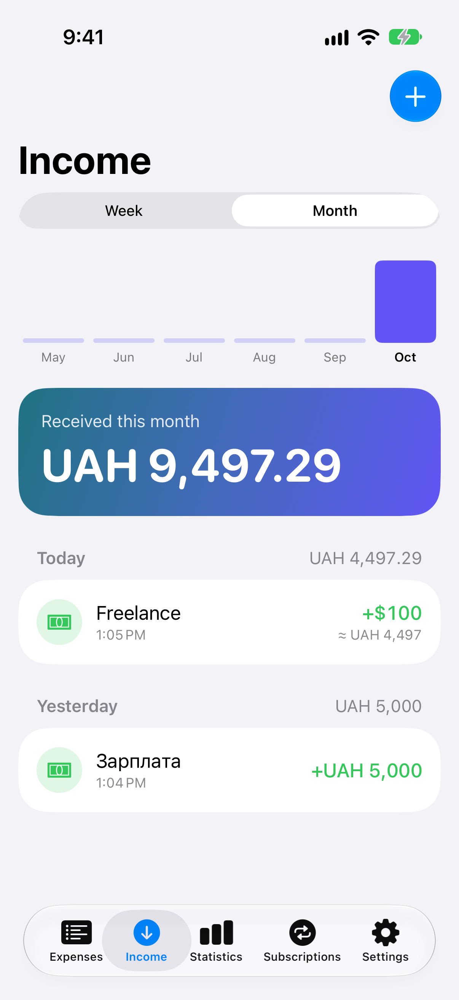
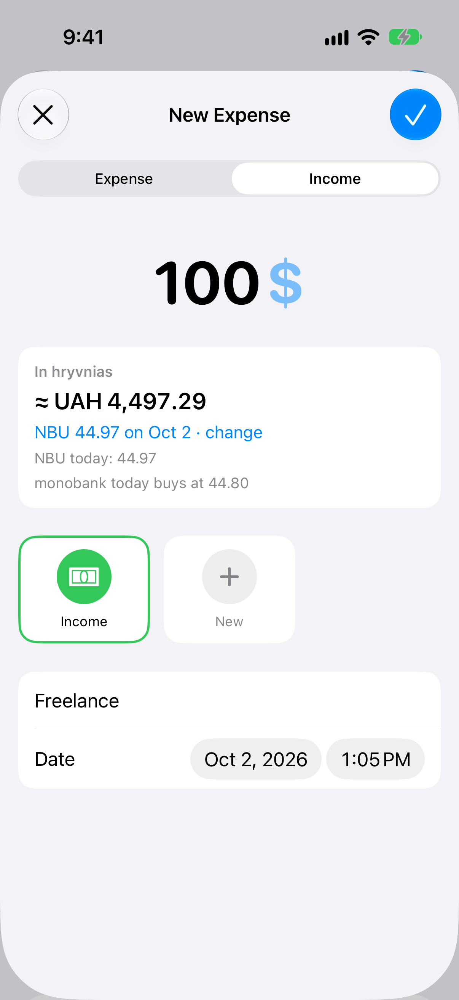
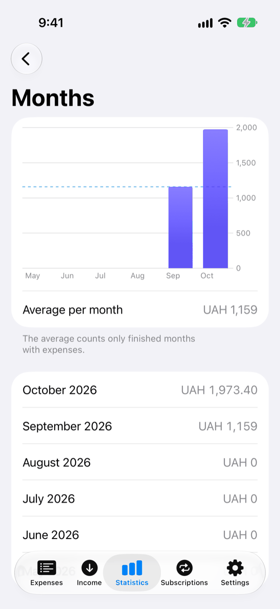
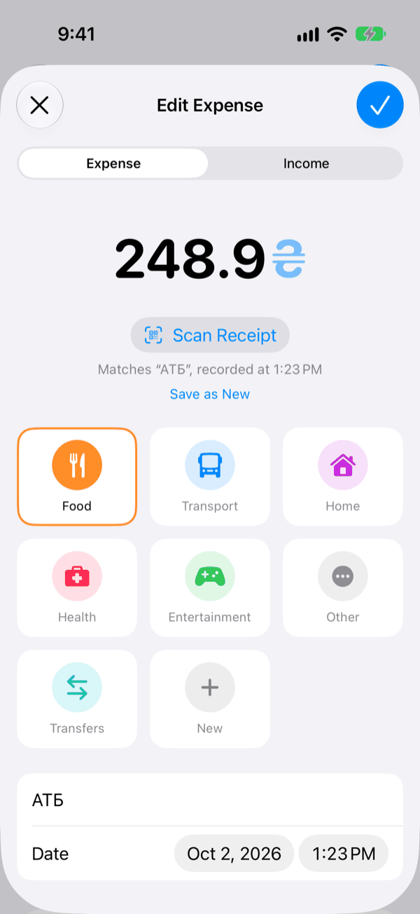
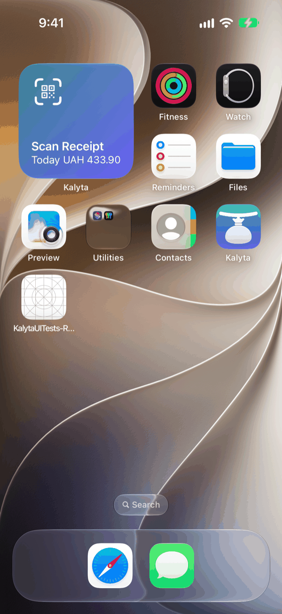

<div align="center">


# Kalyta

**A free, open-source expense tracker for iPhone that lets iOS do the heavy lifting.**
No subscription, no account, no server — your money data stays on your phone.

[](https://developer.apple.com/ios/)
[](https://developer.apple.com/swiftui/)
[](https://www.swift.org)
[](LICENSE)

**English** · [Українська](README.uk.md)

</div>

---

*Kalyta* is an old Ukrainian word for a leather money pouch worn on the belt.

Kalyta for iPhone records spending and income with as little typing as possible: a double tap on the back
of the phone, an automatic entry after every Apple Pay payment, or a scan of the fiscal QR code on a Ukrainian
receipt. Features that paid trackers sell as premium come from iOS itself, so the app stays small.
Everything is stored locally with SwiftData. No subscription, no account, no server.

## Screenshots

<div align="center">


&nbsp;

&nbsp;



&nbsp;

&nbsp;


<sub><em>Expenses · Income · foreign currency (top) — Statistics · receipt scan · widget (bottom)</em></sub>

</div>

## Features

- 💸 **Expenses and income.** Add, edit and delete entries (swipe or long press, with a 5-second Undo), grouped
  by day. The Expenses tab shows spending only; the Income tab lists every income entry with the period total.
- 📊 **Summary and statistics.** A week or month card with bars for the last six periods and a category ring
  (Swift Charts); monthly averages, categories by month, places and the largest expenses over 6 or 12 months or all time.
- 🏷️ **Categories.** Rename or hide built-in ones; create your own with a name, icon and colour.
- 🧾 **Receipt scan.** Reads the fiscal QR code on a Ukrainian receipt for its amount, date and time — on the phone,
  without network. If Apple Pay already recorded the same amount within 30 minutes, the scan updates that entry.
- 💱 **Other currencies.** Enter an amount in dollars, euros or any ISO currency; Kalyta stores it in hryvnias at
  the NBU rate of the entry's date and freezes that rate in the entry. Offline, it uses the last known rate and
  corrects it later.
- 🏦 **monobank, if you want it.** With your personal token Kalyta reads your card statement itself — spending and
  income, no duplicates of Apple Pay entries, no server of ours in between.
- 🔁 **Subscriptions.** Monthly cost, next charge, a reminder the day before, "Record charge" and an automatic
  service icon.
- 📤 **CSV export and import** as your backup, with a preview and no duplicates on re-import.
- 📱 **Widgets and Control Center.** A one-tap scanner and today's total on the Home and Lock Screen (hidden while the
  iPhone is locked); a Scan Receipt control on iOS 18.
- ♿ **Accessible and bilingual.** VoiceOver reads icons, colours and the ring; large text does not break rows;
  English and Ukrainian, light and dark.

## How it works

| feature | how |
|---|---|
| Record an expense with a double tap on the back | Settings → Accessibility → Touch → Back Tap → a shortcut with the **Add Expense** action (Kalyta's App Intent) |
| Record card payments automatically | Shortcuts → Automation → **Transaction** trigger (Wallet / Apple Pay) → the same action; Kalyta picks the category you last gave that merchant |
| Quick entry from a receipt | The fiscal QR code on a receipt holds the amount, date and time; the system VisionKit scanner reads it and Kalyta parses it on the phone. Receipt line items are not available to apps (the tax office page is behind reCAPTCHA) |
| Scanner in one tap | The **Scan Receipt** App Shortcut: Siri, Spotlight, the Action button, Back Tap, a widget; a Control Center button on iOS 18 |
| Spending from a monobank card | Your personal monobank token (optional); the app reads the statement directly |
| Today's total | A WidgetKit widget on the Lock and Home Screen; the amount is hidden while the iPhone is locked |

So the whole app is a database, a few screens, two App Intents (**Add Expense**, **Scan Receipt**) and a widget.
The system does the rest.

## Privacy

- No account, no analytics, no ads, no tracking. Entries never leave the phone.
- Subscription icons come from jsDelivr: that server sees the subscription name and your IP address.
- monobank is off until you paste a token; the token lives in the Keychain on this iPhone only. Counterparty name,
  IBAN, transfer comments and balance are never read.
- Exchange rates are requested only when you have a foreign-currency entry, and only the date is sent.

Details, including how to delete your data: [docs/privacy.md](docs/privacy.md).

## Install

Kalyta is **not on the App Store yet**. To use it now, build it from source.

### Build from source

1. Install Xcode with the iOS 26 SDK (built and tested with Xcode 27). The app runs on iOS 17 and later.
2. Clone the repo and open `Kalyta.xcodeproj`:

   ```sh
   git clone https://github.com/Miozzik/Kalyta.git
   open Kalyta/Kalyta.xcodeproj
   ```

3. For your own iPhone, create `Config/Local.xcconfig` with your Team ID (a free Apple ID works):

   ```
   DEVELOPMENT_TEAM = <your Team ID>
   // A free Apple ID may need a unique bundle id:
   // PRODUCT_BUNDLE_IDENTIFIER = com.example.kalyta
   ```

4. Pick your iPhone and press Run.

With a free Apple ID the signing profile lasts 7 days; after that, press Run again. Your data stays.
Details and the simulator build: [CONTRIBUTING.md](CONTRIBUTING.md).

## Set up quick capture on iPhone

1. **Back Tap.** Shortcuts → new shortcut → **Add Expense** action, and set its **Category** (otherwise the entry
   goes to "Other"). Then Settings → Accessibility → Touch → Back Tap → Double Tap → that shortcut.
2. **Card payments.** Shortcuts → Automation → **Transaction** → **Add Expense**: **Amount** ← Amount,
   **Note** ← Merchant, leave **Category** empty, turn on Run Immediately. Kalyta reuses the category you last gave
   that merchant (case and spaces ignored); a new merchant goes to "Other" — fix it once and it is remembered.
3. **monobank (optional).** Kalyta → Settings → Bank → monobank → "Open api.monobank.ua", tap the QR code, confirm
   in the monobank app, copy the token (shown only once) and paste it in Kalyta.

> Upgrading from a version without custom categories? Open your Add Expense shortcuts and pick the **Category**
> again: iOS does not carry over a saved value after a parameter changes type.

### monobank details

- Kalyta reads one hryvnia account: the black card if there is one, otherwise another hryvnia card, the FOP account
  last. Foreign-currency accounts are not synced; a purchase abroad is recorded in the hryvnias the bank charged.
- It syncs when you open the app (at most once a minute — the bank's limit) and now and then in the background.
- Incoming money becomes income: salary, transfers, refunds (as a separate entry). Jar top-ups and withdrawals
  from your own jars are skipped. Transfers are labelled "Transfer", never with the bank's text.
- An entry you delete does not come back with the next sync.
- "Disconnect" in the same place deletes the token and the sync state; recorded entries stay.

## Backup and CSV

Your data lives only on the phone, so export is your backup.

- **Export:** Settings → **Backup** → **Export Backup** shares `Kalyta-<date>.csv` with every entry (subscriptions
  are not included); save it to Files or iCloud Drive.
  Numbers and Google Sheets open it directly. In Excel use Data → From Text/CSV, UTF-8, comma delimiter.
- **Restore:** Settings → **Backup** → **Import from CSV** → the exported file. A preview shows what will be added, what already
  exists and which rows could not be read; Cancel changes nothing. Import only adds what is missing, so the same file
  twice doubles nothing, and a new phone is restored by importing into an empty app.
- Import accepts only files Kalyta wrote. A file re-saved by Excel has other delimiters and dates — use the original
  export.
- Text starting with `=`, `+`, `-` or `@` is exported with a leading `'` so spreadsheets treat it as text; import
  removes it again.

Subscription reminders: iOS keeps up to 64 pending notifications per app, so Kalyta schedules only the next charge of
each subscription and reschedules on every launch. If you do not open the app for a whole billing cycle, one reminder
may not arrive.

## Contributing

Bug reports and pull requests are welcome — start with [CONTRIBUTING.md](CONTRIBUTING.md).
Security issues: [SECURITY.md](SECURITY.md). Help and FAQ: [docs/support.md](docs/support.md).

## License

[MIT](LICENSE) © 2026 Yehor Merzlov

## Credits

- Subscription icons — [homarr-labs/dashboard-icons](https://github.com/homarr-labs/dashboard-icons) (Apache-2.0),
  fetched at runtime from a pinned commit. Logos belong to their owners.
- Exchange rates — [National Bank of Ukraine open data](https://bank.gov.ua/ua/open-data/api-dev) and the
  [monobank open API](https://api.monobank.ua/docs/).

<sub>Apple, iPhone, Apple Pay, Siri and App Store are trademarks of Apple Inc., registered in the U.S. and other countries and regions.</sub>
