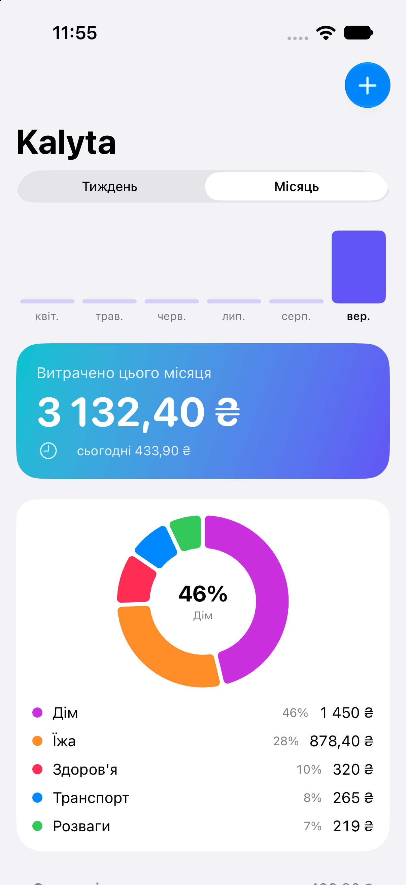

# Kalyta (open source)

**Калита** — старовинний український гаманець-капшук, що носили на поясі.

Безкоштовний opensource-трекер витрат для iOS. Без підписки, без сервера, без акаунта —
дані лежать локально у SwiftData на пристрої.

## Чому це маленький проєкт

Фічі, які в платних аналогів продаються як преміум, насправді дає сама iOS:

| фіча | як зроблено |
|---|---|
| запис витрати подвійним тапом по спинці | Доступність → Тап по задній панелі → запускає Shortcut, який викликає наш App Intent |
| автозапис оплат карткою | Команди → Автоматизація → тригер **Транзакція** (Wallet/Apple Pay) → той самий App Intent |
| розбивка чека по товарах | фіскальний QR на чеку ПРРО веде на `cabinet.tax.gov.ua` і віддає позиції — OCR не потрібен |

Тобто весь застосунок — це база, один екран і один App Intent. Решту робить система.



## Стан

- [x] Модель + локальне сховище (SwiftData)
- [x] Список витрат, підсумок за місяць, ручне додавання
- [x] App Intent `Додати витрату` → Back Tap і автоматизація Транзакція
- [x] Візуал: карта підсумку, донат по категоріях (Swift Charts), групування по днях, темна тема
- [x] Xcode-проєкт (зібраний і запущений у симуляторі)
- [ ] Фіскальний QR → позиції чека
- [ ] Експорт CSV
- [ ] Доходи й рахунки

## Як зібрати

```sh
xcodebuild -scheme Kalyta -destination 'platform=iOS Simulator,name=iPhone 17' build
```

Або просто відкрити `Kalyta.xcodeproj` у Xcode і натиснути Run. Мінімум iOS 17 (SwiftData).

Для запуску на своєму iPhone заміни `DEVELOPMENT_TEAM` у проєкті на свій
(Signing & Capabilities → Team). З безкоштовним Apple ID збірка живе 7 днів,
потім треба запустити Run ще раз.

## Перевірка

```sh
xcrun simctl launch --console-pty booted org.merzlov.kalyta --selfcheck   # → SELFCHECK OK
xcrun simctl launch booted org.merzlov.kalyta --demo                      # наповнити прикладами
```

Доводить головне: запис через `Store.container` (шлях App Intent / Back Tap) читається
тим самим запитом, що й список на екрані, і що суми форматуються правильно.
Перевірка перезапускна — сама чистить за собою.

## Налаштувати швидкий запис на iPhone

1. Команди → новий шорткат → дія **Додати витрату** (з'явиться після встановлення Kalyta).
2. Налаштування → Доступність → Дотик → Тап по задній панелі → Подвійний → цей шорткат.
3. Автозапис оплат: Команди → Автоматизація → **Транзакція** → той самий шорткат.
