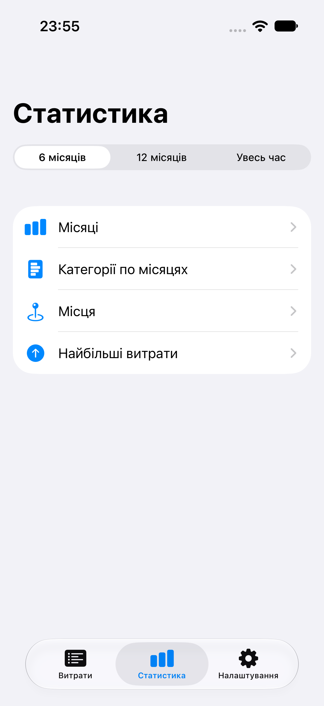
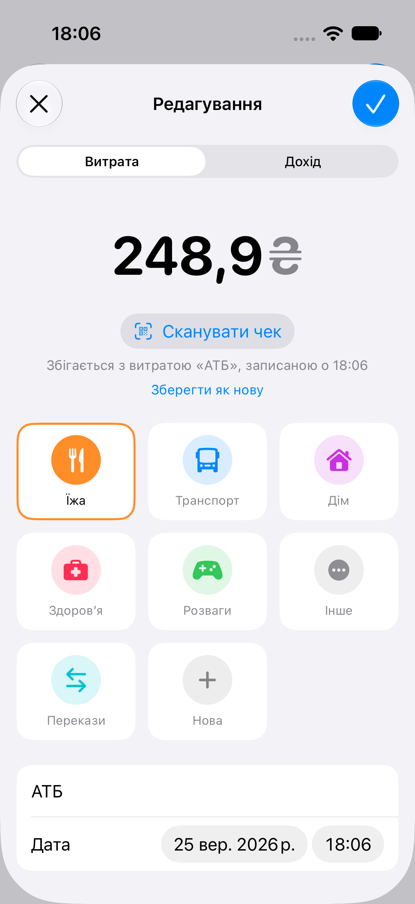
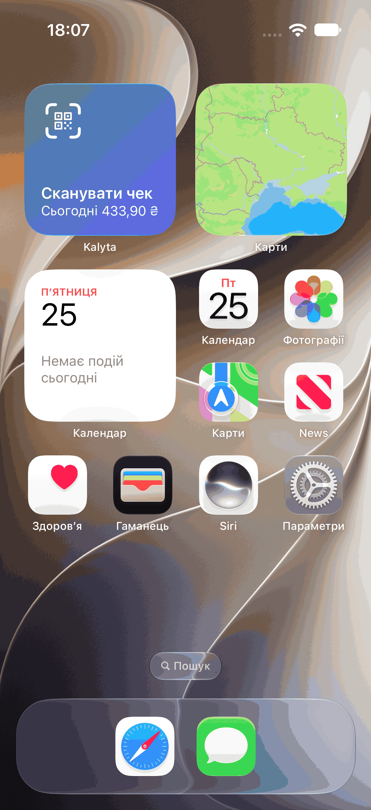

# Kalyta (open source)

**Калита** — старовинний український гаманець-капшук, що носили на поясі.

Безкоштовний opensource-трекер витрат для iOS. Без підписки, без сервера, без акаунта —
дані лежать локально у SwiftData на пристрої.

**Що покидає телефон:**
- Назва підписки — коли ти додаєш або перейменовуєш підписку, застосунок запитує її іконку (`netflix.png`)
  у jsDelivr/GitHub, тож сервер іконок бачить цю назву і твою IP-адресу. Запит підписано просто «Kalyta» —
  без моделі пристрою й версії iOS. Іконка зберігається на телефоні й повторно не завантажується.
- Лише якщо ти вмикаєш синхронізацію з monobank: застосунок напряму (без нашого сервера) запитує виписку
  в api.monobank.ua твоїм особистим токеном. Токен лежить у Keychain лише на цьому iPhone, не переноситься
  на інший iPhone з бекапу і видаляється кнопкою «Відключити»; відкликати його можна на api.monobank.ua (перевірити).
  Ім’я, IBAN і ЄДРПОУ іншої сторони, коментар до переказу й баланс застосунок не читає взагалі. Опис банку
  в переказі може містити ім’я людини, тому переказ (в обидва боки) записується з підписом «Переказ»; у покупок
  і повернень зберігається назва продавця з виписки. Перекази, записані давніше ніж за 31 день до оновлення
  з доходами, лишаються з описом банку — його можна виправити вручну.
  Назви банок читаються лише під час синхронізації і не зберігаються.
  Зберігається лише внутрішній ідентифікатор гривневого рахунку з відповіді monobank (не IBAN і не номер картки) —
  щоб знати, з якого рахунку читати виписку; «Відключити» його видаляє.
  Щоб видалений запис не повернувся з наступною синхронізацією, 35 днів зберігається його ідентифікатор у банку
  й час видалення — без суми, продавця, дати й нотатки; у CSV і App Group цей список не потрапляє.
  «Відключити» видаляє й список видалених записів банку.

Більше нічого: ні сум, ні витрат, ні категорій, ні відсканованих чеків.
Сума за сьогодні зберігається у спільному контейнері App Group для віджета й теж не покидає телефон.

## Чому це маленький проєкт

Фічі, які в платних аналогів продаються як преміум, насправді дає сама iOS:

| фіча | як зроблено |
|---|---|
| запис витрати подвійним тапом по спинці | Параметри → Доступність → Дотик → Тильний дотик → шорткат із дією **Додати витрату** (наш App Intent) |
| автозапис оплат карткою | Команди → Автоматизація → тригер **Транзакція** (Wallet/Apple Pay) → та сама дія; категорію Kalyta бере з пам’яті: що ти востаннє поставив цьому продавцю |
| швидке введення з чека | фіскальний QR на чеку РРО/ПРРО містить суму, дату й час — системний сканер VisionKit читає їх, QR розбирається на телефоні, без мережі. Якщо Apple Pay уже записав ту саму суму в межах 30 хв, чек оновлює цей запис. Позиції чека програмно недоступні (сторінка `cabinet.tax.gov.ua` на reCAPTCHA) |
| сканер одним тапом | дія **Сканувати чек** (App Shortcut): Siri, Spotlight, кнопка дії, Тильний дотик; віджет на екрані блокування й домашньому; на iOS 18 — кнопка в Пункті керування |
| витрати з картки monobank | особистий токен monobank (за бажанням): застосунок сам читає виписку, без нашого сервера |
| сума за сьогодні | віджет WidgetKit на екрані блокування й домашньому; сума прихована, поки iPhone заблоковано |

Тобто весь застосунок — це база, кілька екранів, два App Intent (**Додати витрату**, **Сканувати чек**) і віджет.
Решту робить система.

   

## Стан

Усі 15 етапів злиті в `main`. Що вміє застосунок:

- **Витрати:** ручне додавання, редагування (дата й час — лише до «зараз»), видалення свайпом або довгим тапом
  з плашкою «Відмінити» (5 с; під VoiceOver — без таймера); групування по днях, темна тема.
- **Картка підсумку:** тиждень / місяць зі стовпчиками останніх 6 періодів, кільце по категоріях (Swift Charts).
- **Категорії:** вбудовані можна перейменувати й приховати; свої — з назвою, іконкою й кольором.
- **Доходи:** перемикач «Витрата / Дохід» в аркуші; вкладка «Витрати» доходів не показує й не рахує, як і графіки
  й статистика. Вкладка «Надходження» — усі доходи (з monobank і вручну) по днях із сумою за період.
- **Статистика:** місяці із середнім, категорії за місяцями, місця, найбільші витрати; діапазон 6 / 12 місяців / увесь час.
- **Підписки:** вартість на місяць, наступне списання («Сьогодні», «Завтра» або дата), нагадування за день,
  «Записати списання» в редакторі й свайпом, іконка сервісу автоматично.
- **CSV:** експорт усіх записів через «Поширити» і відновлення з попереднім переглядом, без дублікатів.
- **Чек:** сканування фіскального QR в аркуші вводу; збіг із записом Apple Pay оновлює його, «Зберегти як нову» — вихід.
- **Автоматизація:** дії **Додати витрату** й **Сканувати чек**, пам’ять «продавець → категорія», monobank за бажанням
  (категорія за продавцем, потім за MCC; без дублів із записом Apple Pay; перекази — у «Перекази», крім поповнень банок).
- **Віджети:** сканер одним тапом і сума за сьогодні; кнопка в Пункті керування на iOS 18.
- **Іконка:** калита на поясі, градієнт teal → indigo; світла, темна й тонована з одного джерела Icon Composer.
- **Доступність і мова:** VoiceOver читає іконки, кольори й кільце; великий текст не ламає рядків;
  українська й англійська через String Catalog; на iOS 26 кнопки аркушів — ✕/✓.

Відкриті задачі — у [TODO.md](TODO.md).

## Як зібрати

```sh
xcodebuild -scheme Kalyta -destination 'platform=iOS Simulator,name=iPhone 17' build
```

Або відкрити `Kalyta.xcodeproj` у Xcode і натиснути Run. Потрібен Xcode 27 — на ньому проєкт зібрано й перевірено;
щонайменше треба iOS 26 SDK (`ButtonRole.confirm`, іконка Icon Composer `.icon`). Застосунок працює з iOS 17 (SwiftData). Схема `Kalyta` збирає
застосунок і вбудоване розширення віджетів `KalytaWidgets` (`<bundle id>.widgets`).

Для запуску на своєму iPhone створи `Config/Local.xcconfig` (git його ігнорує):

```
DEVELOPMENT_TEAM = <твій Team ID>
// з безкоштовним Apple ID може знадобитись свій унікальний bundle id:
// PRODUCT_BUNDLE_IDENTIFIER = com.example.kalyta
```

Спільні налаштування збірки — у `Config/Kalyta.xcconfig`, не в `project.pbxproj`.
Застосунок і віджет ділять App Group `group.<bundle id застосунку>` (`APP_GROUP_ID`), тож свій bundle id
дає й свою групу; підпис автоматичний. З безкоштовним Apple ID (Personal Team) профіль кожної цілі
живе 7 днів — потім треба запустити Run ще раз.

## Стиль коду

- Коментарі й документація — англійською, за [Swift API Design Guidelines](https://www.swift.org/documentation/api-design-guidelines/)
  і [Apple DocC](https://developer.apple.com/documentation/xcode/writing-symbol-documentation-in-your-source-files):
  `///` для кожного не-`private` символу, секції `- Parameters:`, `- Returns:`, `- Throws:`.
- Жодного тексту інтерфейсу «намертво» в коді: у коді лише англійський ключ,
  переклад — у String Catalog `Kalyta/Localizable.xcstrings`. У SwiftUI-views літерали
  (`Text("Save")`) локалізуються самі; рядок, що повертається як `String`, — тільки через
  `String(localized:)`, інакше Xcode його не побачить.
- Налаштування користувача — `@AppStorage` / `UserDefaults`; налаштування збірки — `.xcconfig`.
- Форматування — вбудований у Xcode `swift-format` з конфігом `.swift-format` (4 пробіли, 120 символів):

```sh
swift format lint -r Kalyta KalytaUITests KalytaWidgets     # перевірити
swift format -i -r Kalyta KalytaUITests KalytaWidgets       # виправити
```

## Перевірка

```sh
xcodebuild -scheme Kalyta -destination 'platform=iOS Simulator,name=iPhone 17' -derivedDataPath <dd> build
xcrun simctl boot "iPhone 17"
xcrun simctl install booted <dd>/Build/Products/Debug-iphonesimulator/Kalyta.app
xcrun simctl launch --console-pty booted org.merzlov.kalyta --selfcheck -AppleLocale uk_UA   # → SELFCHECK OK
xcrun simctl launch booted org.merzlov.kalyta --demo                      # наповнити прикладами
```

Самоперевірка (`assert` у `Kalyta/*Check.swift` і `SelfCheck.swift`) доводить логіку без UI: суми й періоди,
CSV за RFC 4180 і захист від формул, межі імпорту, розбір QR, збіг із Apple Pay, monobank на фікстурах,
пам’ять продавця, суму за сьогодні. Українська локаль — навмисно: вона ловить кому замість крапки
в сумах експорту. Перевірка перезапускна — сама чистить за собою.
Інші аргументи запуску — `--check-upgrade`, `--measure-import`, `-scanPayload` — описані в `Kalyta/KalytaApp.swift`.

UI-тести (XCTest, 44 тести; 3 пропускаються навмисно: знімки екрана — лише з `KALYTA_SCREENSHOTS=1`,
оновлення шорткату — лише через `scripts/check-shortcut-upgrade.sh`, знімки посібника — лише через
`scripts/autopay-screenshots.sh`):

```sh
perl -e 'alarm 900; exec @ARGV' xcodebuild test -scheme Kalyta -destination 'platform=iOS Simulator,name=iPhone 17' \
  -test-timeouts-enabled YES -default-test-execution-time-allowance 90
```

- `xcodebuild test` іноді не виходить після завершення тестів — тому сторож часу `alarm`.
- Тести віджетів: встановити застосунок → перезавантажити симулятор → запускати. На щойно стертому симуляторі
  галерея віджетів не бачить нового застосунку до перезавантаження.
- Повний набір — один одночасно і на тихій машині: під навантаженням флейкають вибір документа та інші UI-тести.
- Кожна нова логіка доводиться мутацією: навмисно зламати на копії → перевірка червона. XCTest пов’язує падіння
  із застосунком за bundle id і назвою процесу, тож падіння мутації на будь-якому симуляторі валить чужий UI-прогін
  («Critical process Kalyta crashed»). Тому в **копії**: `PRODUCT_BUNDLE_IDENTIFIER = org.merzlov.kalyta.mutation`
  у `Config/Kalyta.xcconfig` і `PRODUCT_NAME = KalytaMutation` замість обох `PRODUCT_NAME = "$(TARGET_NAME)";`
  цілі застосунку в `project.pbxproj`. Ніколи не з командного рядка `xcodebuild`: там це перейменовує й
  раннер UI-тестів, і кожен запуск падає.
- Перед релізом, що змінює параметри дії **Додати витрату**: `scripts/check-shortcut-upgrade.sh` (збережений шорткат
  мусить пережити оновлення).
- Знімки Команд у посібнику «Автозапис оплат» (англійська й українська, у `Kalyta/Assets.xcassets/Autopay*`):
  `scripts/autopay-screenshots.sh` — стирає й перемикає мову симулятора «iPhone 17 Autopay», тож не спільний «iPhone 17».
  Тригер **Транзакція** (крок 2) на симуляторі недоступний — цей знімок лише з iPhone.

## Переклад

Мова розробки — англійська, переклад — українська. Каталоги: `Kalyta/Localizable.xcstrings` (інтерфейс),
`Kalyta/InfoPlist.xcstrings` (текст дозволу на камеру), `Kalyta/AppShortcuts.xcstrings` (фрази Siri).
Xcode у IDE сам додає нові рядки з коду при збірці; з командного рядка — `xcrun xcstringstool sync`.
Перевірити, що нічого не лишилось без перекладу:

```sh
scripts/check-translations.py        # → All N strings are translated.
```

## Експорт CSV

Кнопка «Поширити» зліва вгорі віддає файл `Kalyta-<дата>.csv` з **усіма** витратами —
це резервна копія, бо дані живуть лише на телефоні.

Колонки (порядок сталий, нові додаються **лише в кінець**):

| колонка | приклад | формат |
|---|---|---|
| `date` | `2026-09-23T12:18:00+03:00` | ISO 8601, місцевий час із поясом |
| `amount` | `878.4` | число з крапкою, без пробілів і символу валюти |
| `currency` | `UAH` | ISO 4217 |
| `category` | `food` | сталий ключ, не залежить від мови |
| `category_name` | `Їжа` | назва мовою застосунку |
| `note` | `АТБ` | як є; у лапках, якщо є кома, лапки чи перенос рядка (RFC 4180) |
| `category_symbol` | `fork.knife` | назва SF Symbol іконки категорії |
| `category_color` | `orange` | назва кольору з палітри (не RGB — щоб працювала темна тема) |
| `kind` | `expense` | `expense` або `income`; у файлах без цієї колонки всі рядки — витрати |

Numbers і Google Sheets відкривають файл одразу. **Excel:** «Дані → З тексту/CSV», кодування UTF-8,
роздільник — кома (подвійний клік в українському Excel чекає `;` і складе все в одну колонку).
**Захист від формул:** текст, що починається з `=`, `+`, `-`, `@`, табуляції, переносу рядка або їхніх
повноширинних варіантів (`＝＋－＠`), експортується з `'` на початку — таблиця відкриє його як текст.
Імпорт цей `'` прибирає, тож `=1+1` повертається тим самим.

## Відновлення з резервної копії

Налаштування → **Імпорт із CSV** → файл експорту. Перед записом показується, скільки витрат буде
додано, скільки вже є і які рядки не прочитались — «Скасувати» нічого не змінює. Імпорт лише
**додає** відсутнє: той самий файл двічі нічого не подвоїть, а відновлення на новому телефоні —
це імпорт у порожній застосунок. Свої категорії відтворюються з тими самими ключами; якщо категорія
вже є, її поточна назва, іконка й колір лишаються.

Імпорт приймає рядок, лише якщо дата — від 2000-01-01 до завтра, сума більша за 0 і не більша за 10 000 000,
ключ категорії — до 64 символів, назва — до 100, нотатка — до 1000, а вид запису збігається з категорією
(дохід не потрапить у витратну категорію). Решта рядків показується як непрочитані. Файл читається не більше 10 МБ.

Приймається лише файл, який зробила сама Kalyta. Файл, перезбережений в Excel, має інші роздільники,
десяткову кому й дати без поясу — його треба не «виправляти», а взяти оригінальний експорт.

## Налаштувати швидкий запис на iPhone

1. Команди → новий шорткат → дія **Додати витрату** (з’явиться після встановлення Kalyta).
   Для Back Tap задай у дії **Категорію** — інакше витрата запишеться як «Інше» (виправити можна потім, торкнувшись рядка).
2. Параметри → Доступність → Дотик → Тильний дотик → Подвійний → цей шорткат.
3. Автозапис оплат: Команди → Автоматизація → **Транзакція** → дія **Додати витрату**:
   **Сума** ← змінна «Сума» (Amount), **Нотатка** ← «Продавець» (Merchant), **Категорію лишити порожньою**;
   увімкнути «Запускати негайно» (Run Immediately). Kalyta сама бере категорію останньої витрати в цього
   продавця (без різниці в регістрі й пробілах); новий продавець іде в «Інше» — виправ раз, далі запам’ятається.

> Оновлюєшся з версії без своїх категорій? Відкрий шорткати «Додати витрату» (Back Tap і «Транзакція»)
> і вибери **Категорію** заново: після зміни типу параметра iOS не переносить збережене значення,
> і без цього витрати падатимуть в «Інше» (їх можна виправити редагуванням).

## monobank (за бажанням)

Kalyta може сама підтягувати витрати й надходження з картки monobank. Це вимкнено, доки ти не вставиш токен.

**Як увімкнути:**
1. Kalyta → Налаштування → Банк → monobank → «Відкрити api.monobank.ua».
2. Натисни на QR-код, підтверди в застосунку monobank і скопіюй токен (його показують лише раз).
3. Повернись у Kalyta й встав токен — застосунок сам його перевірить.

Kalyta читає гривневий рахунок: чорну картку, якщо вона є, інакше іншу гривневу картку, рахунок ФОП — в останню чергу.
Рахунок за замовчуванням у monobank може бути валютним, тому він не береться наосліп; валютні рахунки не синхронізуються.
Покупка за кордоном записується в гривнях — сумою, яку банк списав із гривневого рахунку.

Застосунок синхронізується, коли ти його відкриваєш (не частіше ніж раз на хвилину — таке обмеження банку),
і час від часу у фоні. Витрата, яку вже записав Apple Pay, не дублюється: вона отримує позначку банку.

Надходження на картку стають доходом у категорії «Дохід»: зарплата, переказ від людини, повернення
за покупку (окремим записом під назвою продавця, витрата лишається). Гроші з власної банки, як і поповнення
банки, не записуються. Дохід, який ти вже вписав вручну (та сама сума ±30 хв), не дублюється.
Після оновлення застосунок один раз перечитує останні 31 день, щоб додати минулі надходження; видалені
витрати при цьому не повертаються. Видалений запис із банку наступна синхронізація теж не повертає.

**Як вимкнути:** Kalyta → Налаштування → Банк → monobank → «Відключити». Токен і список видалених записів
банку видаляються, уже записані витрати й доходи лишаються. Щоб токен перестав діяти зовсім, відклич його на https://api.monobank.ua/
(перевірити: у документації API відкликання не описано).

## Ліцензія

MIT — див. [LICENSE](LICENSE). Політика конфіденційності — [docs/privacy.md](docs/privacy.md),
підтримка — [docs/support.md](docs/support.md).

## Подяки

Іконки сервісів — [homarr-labs/dashboard-icons](https://github.com/homarr-labs/dashboard-icons)
(Apache-2.0), завантажуються під час роботи з закріпленого коміту. Логотипи належать їхнім власникам
і не використовуються на скріншотах для App Store (App Review Guidelines 5.2.1).

Нагадування: iOS тримає до 64 запланованих сповіщень на застосунок, тож плануємо лише найближче
списання кожної підписки й оновлюємо розклад при кожному відкритті. Якщо не відкривати застосунок
довше за один цикл підписки, одне нагадування може не прийти.
