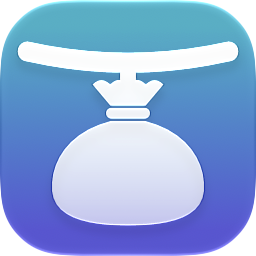
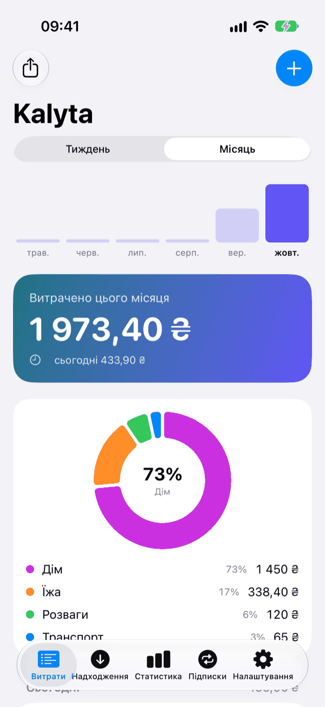
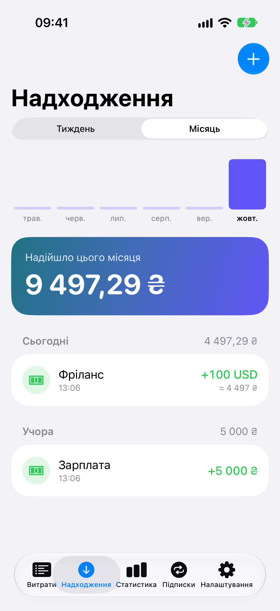
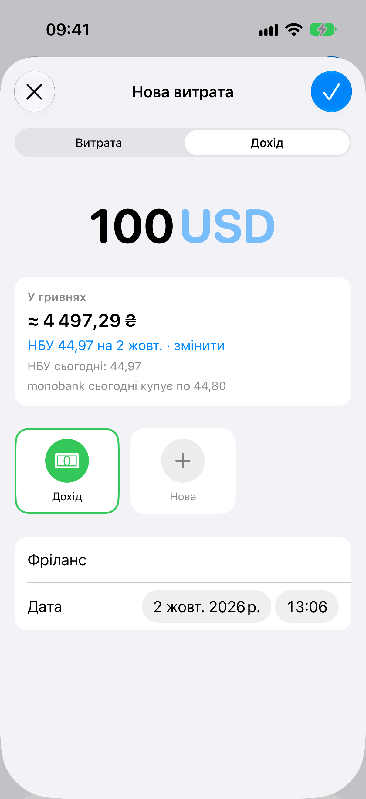
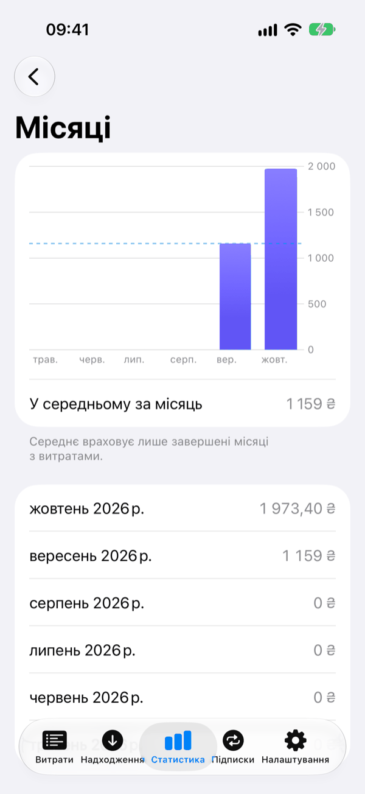
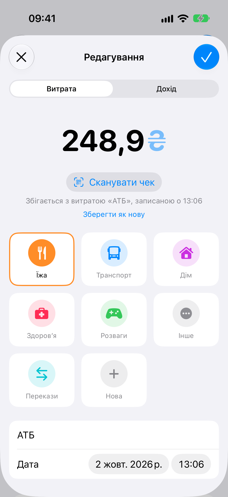
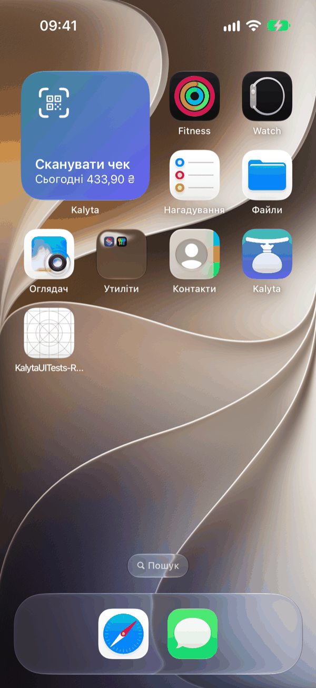

<div align="center">



# Kalyta

**Безкоштовний opensource-трекер витрат для iPhone, у якому важку роботу робить сама iOS.**
Без підписки, без акаунта, без сервера — твої гроші лишаються на телефоні.

[](https://developer.apple.com/ios/)
[](https://developer.apple.com/swiftui/)
[](https://www.swift.org)
[](LICENSE)

[English](README.md) · **Українська**

</div>

---

**Калита** — старовинний український гаманець-капшук, що носили на поясі.

Kalyta для iPhone записує витрати й доходи з мінімумом набору: подвійний тап по спинці телефона, автозапис
після кожної оплати Apple Pay або сканування фіскального QR на чеку. Фічі, які платні аналоги продають як преміум,
дає сама iOS, тож застосунок лишається маленьким. Усе зберігається локально у SwiftData.
Без підписки, без акаунта, без сервера.

## Знімки екрана

<div align="center">


&nbsp;

&nbsp;



&nbsp;

&nbsp;


<sub><em>Витрати · Надходження · іноземна валюта (вгорі) — Статистика · сканування чека · віджет (внизу)</em></sub>

</div>

## Можливості

- 💸 **Витрати й доходи.** Додавання, редагування й видалення свайпом або довгим тапом із плашкою «Відмінити» (5 с),
  групування по днях. Вкладка «Витрати» показує лише витрати; «Надходження» — усі доходи із сумою за період.
- 📊 **Підсумок і статистика.** Картка тижня / місяця зі стовпчиками останніх 6 періодів і кільцем по категоріях
  (Swift Charts); середнє за місяць, категорії за місяцями, місця й найбільші витрати за 6 / 12 місяців або весь час.
- 🏷️ **Категорії.** Вбудовані можна перейменувати й приховати; свої — з назвою, іконкою й кольором.
- 🧾 **Сканування чека.** Фіскальний QR на чеку РРО/ПРРО дає суму, дату й час — розбирається на телефоні, без мережі.
  Якщо Apple Pay уже записав ту саму суму в межах 30 хв, чек оновлює цей запис.
- 💱 **Інші валюти.** Сума в доларах, євро чи будь-якій валюті ISO; Kalyta зберігає її в гривнях за курсом НБУ на дату
  запису й фіксує цей курс у записі. Без мережі бере останній відомий курс і потім уточнює.
- 🏦 **monobank за бажанням.** З твоїм особистим токеном Kalyta сама читає виписку картки — витрати й надходження,
  без дублів із записами Apple Pay і без нашого сервера посередині.
- 🔁 **Підписки.** Вартість на місяць, наступне списання, нагадування за день, «Записати списання», іконка сервісу
  автоматично.
- 📤 **Повна резервна копія** (JSON: записи, категорії, підписки) і **CSV для таблиць** — з попереднім переглядом і без дублікатів.
- 📱 **Віджети й Пункт керування.** Сканер одним тапом і сума за сьогодні на домашньому екрані й екрані блокування
  (прихована, поки iPhone заблоковано); кнопка «Сканувати чек» у Пункті керування на iOS 18.
- ♿ **Доступність і дві мови.** VoiceOver читає іконки, кольори й кільце; великий текст не ламає рядків;
  українська й англійська, світла й темна тема.

## Як це працює

| фіча | як зроблено |
|---|---|
| запис витрати подвійним тапом по спинці | Параметри → Доступність → Дотик → Тильний дотик → шорткат із дією **Додати витрату** (наш App Intent) |
| автозапис оплат карткою | Shortcuts (Команди) → Автоматизація → тригер **Транзакція** (Wallet / Apple Pay) → та сама дія; категорію Kalyta бере з пам’яті: що ти востаннє поставив цьому продавцю |
| швидке введення з чека | фіскальний QR на чеку містить суму, дату й час — системний сканер VisionKit читає їх, QR розбирається на телефоні. Позиції чека програмно недоступні (сторінка податкової на reCAPTCHA) |
| сканер одним тапом | дія **Сканувати чек** (App Shortcut): Siri, Spotlight, кнопка дії, Тильний дотик, віджет; на iOS 18 — кнопка в Пункті керування |
| витрати з картки monobank | особистий токен monobank (за бажанням): застосунок сам читає виписку, без нашого сервера |
| сума за сьогодні | віджет WidgetKit на екрані блокування й домашньому; сума прихована, поки iPhone заблоковано |

Тобто весь застосунок — це база, кілька екранів, два App Intent (**Додати витрату**, **Сканувати чек**) і віджет.
Решту робить система.

## Приватність

- Немає акаунта, аналітики, реклами й відстеження. Записи не покидають телефон.
- Іконки підписок завантажуються з jsDelivr: цей сервер бачить назву підписки й твою IP-адресу.
- monobank вимкнено, доки ти не вставиш токен; токен лежить у Keychain лише на цьому iPhone. Ім’я й IBAN іншої
  сторони, коментар до переказу й баланс застосунок не читає.
- Курси валют запитуються, лише коли є запис в іноземній валюті, і надсилається лише дата.

Докладно, зокрема як видалити дані: [docs/privacy.md](docs/privacy.md).

## Встановлення

Kalyta **ще немає в App Store**. Щоб користуватися вже зараз, збери її з коду.

### Збірка з коду

1. Встанови Xcode з iOS 26 SDK (проєкт зібрано й перевірено на Xcode 27). Застосунок працює з iOS 17.
2. Клонуй репозиторій і відкрий `Kalyta.xcodeproj`:

   ```sh
   git clone https://github.com/Miozzik/Kalyta.git
   open Kalyta/Kalyta.xcodeproj
   ```

3. Для свого iPhone створи `Config/Local.xcconfig` зі своїм Team ID (підійде безкоштовний Apple ID):

   ```
   DEVELOPMENT_TEAM = <твій Team ID>
   // з безкоштовним Apple ID може знадобитись свій унікальний bundle id:
   // PRODUCT_BUNDLE_IDENTIFIER = com.example.kalyta
   ```

4. Вибери свій iPhone і натисни Run.

З безкоштовним Apple ID профіль підпису живе 7 днів — потім натисни Run ще раз. Дані лишаються.
Подробиці й збірка для симулятора — у [CONTRIBUTING.md](CONTRIBUTING.md) (англійською).

## Налаштувати швидкий запис на iPhone

Kalyta → Налаштування → **Автоматизація** показує всі способи нижче зі статусом («Налаштовано N з 5») і коротку інструкцію.

1. **Тильний дотик.** Shortcuts (Команди) → новий шорткат → дія **Додати витрату**, задай у ній **Категорію**
   (інакше запис піде в «Інше»). Потім Параметри → Доступність → Дотик → Тильний дотик → Подвійний → цей шорткат.
2. **Оплати карткою.** Команди → Автоматизація → **Транзакція** → **Додати витрату**: **Сума** ← «Сума»,
   **Нотатка** ← «Продавець», **Категорію лишити порожньою**; увімкнути «Запускати негайно». Kalyta сама бере
   категорію, яку ти востаннє поставив цьому продавцю (без різниці в регістрі й пробілах); новий продавець іде
   в «Інше» — виправ раз, далі запам’ятається.
3. **monobank (за бажанням).** Kalyta → Налаштування → Автоматизація → Синхронізація monobank → «Відкрити api.monobank.ua», натисни
   на QR-код, підтверди в застосунку monobank, скопіюй токен (його показують лише раз) і встав у Kalyta.

> Оновлюєшся з версії без своїх категорій? Відкрий шорткати «Додати витрату» й вибери **Категорію** заново:
> після зміни типу параметра iOS не переносить збережене значення.

### monobank докладніше

- Kalyta читає один гривневий рахунок: чорну картку, якщо вона є, інакше іншу гривневу картку, рахунок ФОП — в останню
  чергу. Валютні рахунки не синхронізуються; покупка за кордоном записується в гривнях, які списав банк.
- Синхронізація — коли ти відкриваєш застосунок (не частіше ніж раз на хвилину — обмеження банку) і час від часу у фоні.
- Надходження стають доходом: зарплата, перекази, повернення (окремим записом). Поповнення банок і зняття з власних
  банок не записуються. Перекази підписуються «Переказ», а не текстом банку.
- Видалений запис наступна синхронізація не повертає.
- «Відключити» там само видаляє токен і стан синхронізації; уже записані витрати й доходи лишаються.

## Резервна копія і CSV

Дані живуть лише на телефоні, тож експорт — це твоя резервна копія.

- **Резервна копія:** Налаштування → **Резервна копія** → **Експортувати резервну копію** зберігає `Kalyta-<дата>.json`
  з усіма записами, категоріями й підписками (без іконок підписок, токена monobank і стану синхронізації) у Файли або
  iCloud Drive. Рядок «Резервна копія» в Налаштуваннях показує, коли копію востаннє збережено. Це звичайний
  незашифрований файл — зберігай його там, де довіряєш.
- **Для таблиць:** **Експорт для таблиць (CSV)** віддає `Kalyta-<дата>.csv` з усіма записами — не для відновлення
  застосунку. Numbers і Google Sheets відкривають файл одразу. В Excel — «Дані → З тексту/CSV», UTF-8, роздільник — кома.
- **Відновлення:** Налаштування → **Резервна копія** → **Імпортувати резервну копію** → `.json`-копія або `.csv`-експорт.
  Перед записом видно по кожному типу, що буде додано, що вже є і що не прочиталось; «Скасувати» нічого не змінює.
  Імпорт лише додає: нічого не видаляє й не змінює (наявна категорія лишається як на цьому телефоні), тож той самий
  файл двічі нічого не додасть. У порожній застосунок вбудовані категорії беруть назви й порядок із копії.
- Приймається лише файл, який зробила сама Kalyta. Файл, перезбережений в Excel, має інші роздільники й дати —
  бери оригінальний експорт.
- Текст, що починається з `=`, `+`, `-` чи `@`, експортується з `'` на початку, щоб таблиця відкрила його як текст;
  імпорт цей `'` прибирає.

Нагадування підписок: iOS тримає до 64 запланованих сповіщень на застосунок, тож Kalyta планує лише найближче
списання кожної підписки й оновлює розклад при кожному відкритті. Якщо не відкривати застосунок довше за один цикл
підписки, одне нагадування може не прийти.

## Участь

Звіти про помилки й pull request’и вітаються — почни з [CONTRIBUTING.md](CONTRIBUTING.md).
Вразливості — [SECURITY.md](SECURITY.md). Допомога й FAQ — [docs/support.md](docs/support.md).

## Ліцензія

[MIT](LICENSE) © 2026 Yehor Merzlov

## Подяки

- Іконки сервісів — [homarr-labs/dashboard-icons](https://github.com/homarr-labs/dashboard-icons) (Apache-2.0),
  завантажуються під час роботи з закріпленого коміту. Логотипи належать їхнім власникам.
- Курси валют — [відкриті дані НБУ](https://bank.gov.ua/ua/open-data/api-dev) і
  [відкритий API monobank](https://api.monobank.ua/docs/).

<sub>Apple, iPhone, Apple Pay, Siri and App Store are trademarks of Apple Inc., registered in the U.S. and other countries and regions.</sub>
